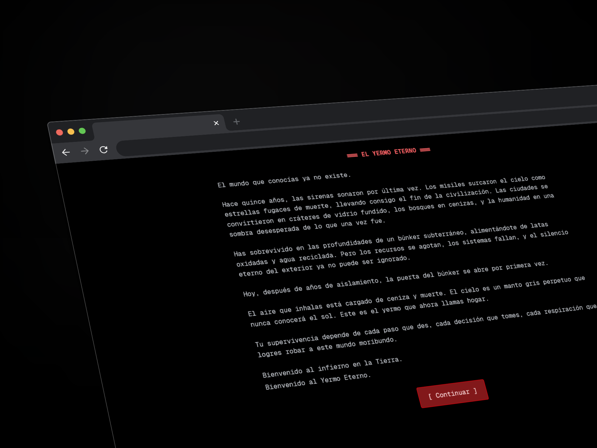
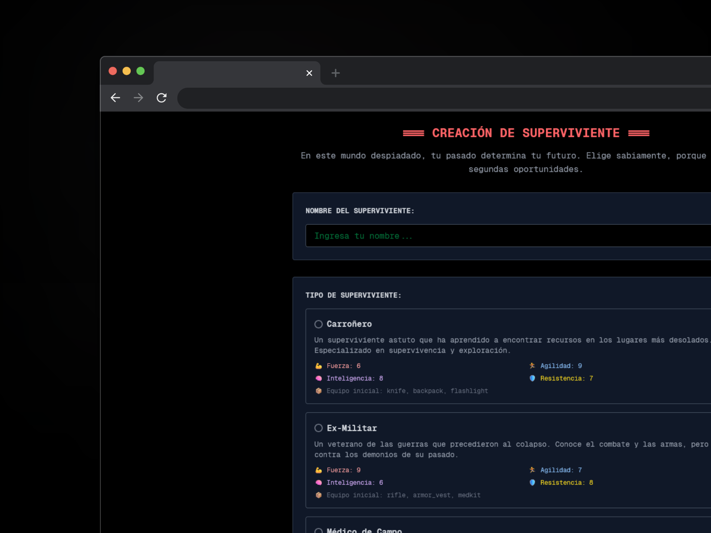
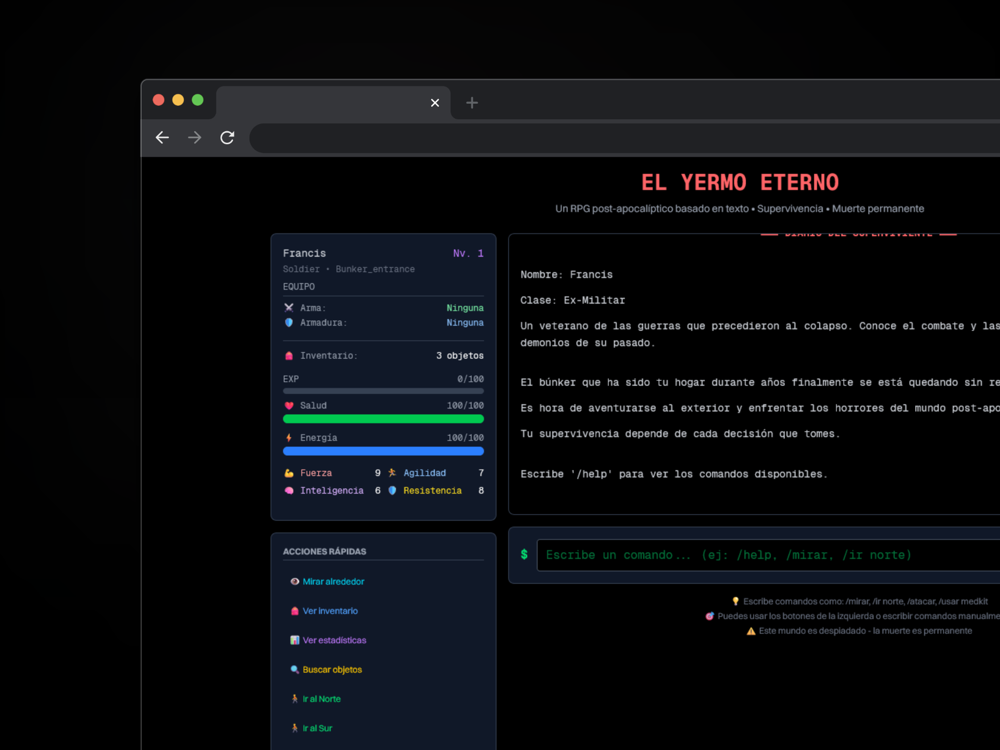

# El Yermo Eterno - RPG Post-Apocalíptico

Un juego de rol basado en texto desarrollado en Next.js con temática post-apocalíptica. Los jugadores deben sobrevivir en un mundo devastado, combatir criaturas mutantes, gestionar recursos y tomar decisiones que determinarán su destino.

## 🎮 Características Principales

- **Sistema de comandos de consola**: Interactúa escribiendo comandos como `/ir norte`, `/atacar`, `/usar medkit`
- **3 clases de supervivientes**: Carroñero, Ex-Militar, Médico de Campo
- **Combate por turnos**: Sistema táctico con armas, armaduras y durabilidad
- **20+ tipos de enemigos**: Desde cucarachas radiactivas hasta espectros cibernéticos
- **10+ localizaciones**: Explora el búnker, yermo tóxico, bosques muertos y más
- **Sistema de niveles**: Gana experiencia y mejora tus estadísticas
- **Inventario completo**: Gestiona armas, armaduras, consumibles y objetos misc
- **Muerte permanente**: Cada decisión cuenta en este mundo despiadado
- **Narrativa inmersiva**: Descripciones atmosféricas al estilo Metro 2033/Fallout
- **Persistencia local**: Guarda tu progreso automáticamente

## 🏗️ Estructura del Proyecto

```
wasteland-rpg/
├── app/
│   ├── layout.tsx          # Layout principal con fuentes y metadatos
│   ├── page.tsx            # Página principal
│   └── globals.css         # Estilos globales y tema oscuro
├── components/
│   ├── CharacterCreation.tsx    # Creación de personaje con historia
│   ├── MainGame.tsx            # Componente principal del juego
│   ├── GameLog.tsx             # Log narrativo con formato
│   ├── CommandInput.tsx        # Input de comandos con historial
│   └── PlayerStatus.tsx        # Panel de estado del jugador
├── data/
│   ├── survivorTypes.ts        # Tipos de supervivientes y stats
│   ├── items.ts               # Armas, armaduras y consumibles
│   ├── enemies.ts             # 20+ enemigos con loot y descripciones
│   ├── locations.ts           # 10+ localizaciones del yermo
│   └── story.ts               # Narrativa principal y trasfondos
├── engine/
│   └── gameEngine.ts          # Motor principal del juego
├── store/
│   └── gameStore.ts           # Estado global con Zustand
├── types/
│   └── GameTypes.ts           # Interfaces TypeScript
├── utils/
│   └── commandParser.ts       # Intérprete de comandos
├── package.json               # Dependencias del proyecto
├── tailwind.config.js         # Configuración de Tailwind CSS
└── README.md                  # Esta documentación
```

## 🚀 Instalación y Ejecución

```bash
# Clonar el proyecto
git clone [url-del-repositorio]
cd wasteland-rpg

# Instalar dependencias
npm install

# Ejecutar en desarrollo
npm run dev

# Construir para producción
npm run build
npm start
```

## 🎯 Comandos de Juego

### Movimiento

- `/ir [dirección]` - Moverse (norte, sur, este, oeste)
- `/norte`, `/sur`, `/este`, `/oeste` - Movimiento directo

### Combate

- `/atacar` - Atacar al enemigo actual
- `/huir` - Intentar escapar del combate

### Inventario y Objetos

- `/inventario` - Ver inventario completo
- `/usar [objeto]` - Usar consumibles
- `/equipar [arma/armadura]` - Equipar objetos

### Exploración

- `/mirar` - Examinar ubicación actual
- `/buscar` - Buscar objetos en el área

### Información

- `/stats` - Ver estadísticas del personaje
- `/ayuda` - Mostrar lista de comandos

### Sistema

- `/reiniciar` - Reiniciar el juego

## 🔧 Tecnologías Utilizadas

- **Next.js 14** (App Router)
- **React 18** con Hooks
- **TypeScript** para tipado estático
- **Zustand** para gestión de estado
- **Tailwind CSS** para estilado
- **IBM Plex Mono** como fuente principal
- **LocalStorage** para persistencia

## 🎨 Diseño y UI

- **Tema oscuro por defecto** con colores post-apocalípticos
- **Tipografía monoespaciada** para efecto terminal
- **Paleta de colores**: Negro/gris oscuro con acentos verdes, rojos y amarillos
- **Responsive design** adaptado a diferentes dispositivos
- **Animaciones suaves** para barras de vida y transiciones

## 🧠 Arquitectura del Código

### Separación de Responsabilidades

1. **Components**: UI reactivos sin lógica de negocio
2. **Engine**: Lógica del juego centralizada
3. **Store**: Estado global reactivo
4. **Data**: Configuración estática del juego
5. **Utils**: Funciones utilitarias puras
6. **Types**: Interfaces TypeScript compartidas

### Flujo de Datos

```
User Input → CommandParser → GameEngine → GameStore → React Components
```

### Patrones Implementados

- **Command Pattern**: Para procesamiento de comandos
- **Observer Pattern**: Zustand para estado reactivo
- **Factory Pattern**: Creación de enemigos y objetos
- **Strategy Pattern**: Diferentes tipos de supervivientes

## 🎲 Mecánicas de Juego

### Sistema de Combate

- Daño basado en fuerza + arma - defensa enemigo
- Durabilidad de equipamiento que se degrada
- Posibilidad de huida basada en agilidad
- EXP y loot al derrotar enemigos

### Progresión del Personaje

- 4 estadísticas: Fuerza, Agilidad, Inteligencia, Resistencia
- Sistema de niveles con aumento de stats
- 3 clases iniciales con diferentes bonificaciones

### Exploración

- 10+ localizaciones interconectadas
- Encuentros aleatorios con enemigos
- Objetos ocultos que encontrar
- Narrativa contextual por ubicación

## 🎪 Características Futuras (Roadmap)

- [ ] Sistema de crafteo
- [ ] Más tipos de objetos y efectos
- [ ] NPCs con diálogos
- [ ] Misiones y objetivos
- [ ] Múltiples finales
- [ ] Sistema de reputación
- [ ] Eventos aleatorios
- [ ] Modo multijugador cooperativo

## 🐛 Debugging y Desarrollo

- Todos los comandos se logean para debugging
- Estado del juego se persiste automáticamente
- Validación de comandos y manejo de errores
- TypeScript previene errores en tiempo de compilación

## 📝 Notas de Desarrollo

Este proyecto está diseñado con **arquitectura modular y escalable**:

- **Fácil agregar nuevos comandos**: Modificar `commandParser.ts` y `gameEngine.ts`
- **Fácil agregar contenido**: Nuevos enemigos, items o localizaciones solo requieren modificar archivos JSON
- **Estado reactivo**: Cambios se reflejan automáticamente en la UI
- **Tipado fuerte**: TypeScript previene errores comunes

El código está estructurado para ser mantenible y extensible, siguiendo principios SOLID y clean architecture.
